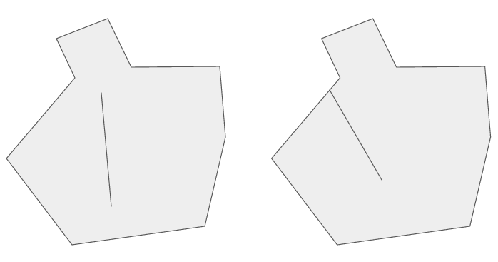
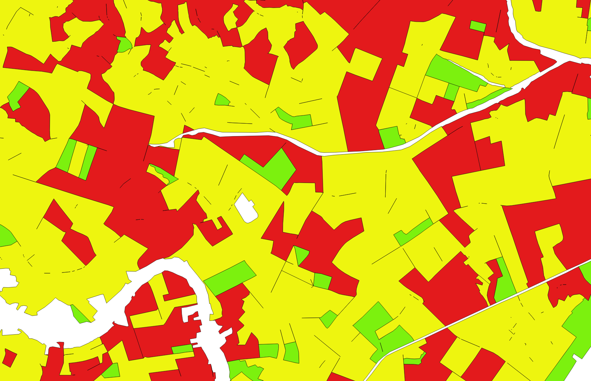
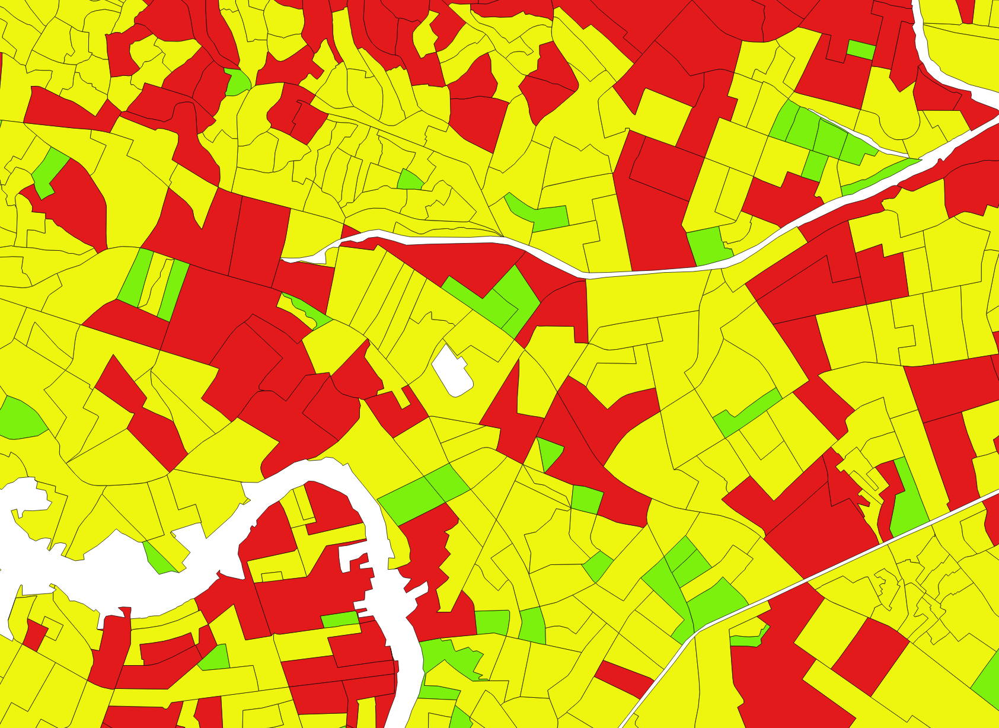
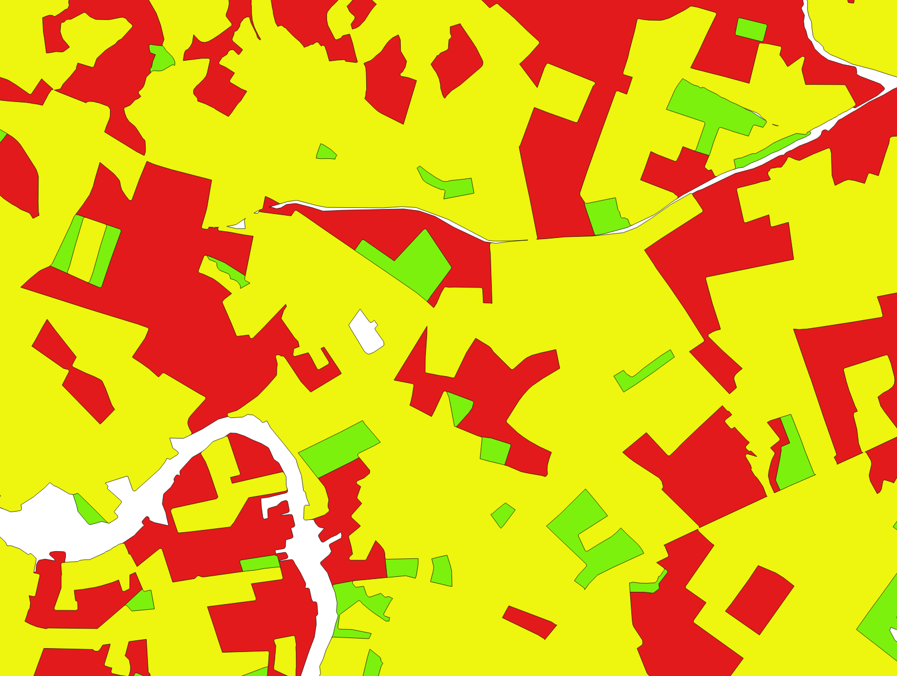

# Problema de performance na consulta do algoritmo P2R2

Primeiro precisamos entender o porquê daqueles valores "esquisitos" que foram colocados na função buffer, ex.:

```sql
  SELECT
      graurisco,
      -- valor abaixo: 0.000000005
      ST_MemUnion(ST_Buffer(the_geom, 0.000000005)),
      risco
    FROM assentamentohumano
    GROUP BY graurisco, risco;
```

Na prática, esse valor não tem relevância nenhuma por ser muito pequeno, mas verificando os resultados, cheguei
a conclusão que esse valor é para impedir a criação de **gaps** (buracos) após o *dissolve*, que é feito com a consulta anterior.





Veja o que acontece se fizermos apenas o union, sem o buffer:

```sql
  SELECT
      graurisco,
      ST_MemUnion(the_geom),
      risco
    FROM assentamentohumano
    GROUP BY graurisco, risco;
```


Justamente, surgem vários **gaps** com essa consulta. O resultado é esse:




Quando a consulta é feita com o buffer e um valor de distância (que eu acredito que foi encontrado de forma empírica), esses gaps são dissolvidos, porque os limites entres os polígonos se sobrepõem. O problema estava justamente na demora. O resultado que é esperado antes e depois são mostrados nas figuras a seguir:


## Antes: Camada assentamentohumano Original:



## Depois: Resultado Esperado do Dissolve:




## A questão é: como fazer isso de forma mais rápida?

Seguindo os passos a seguir, encontrei a solução:


```sql
-- Primeiro, cria-se os índices e se faz a manutenção necessária para o seu correto funcionamento:

CREATE INDEX assentamentohumano_gix
  ON assentamentohumano USING GIST (the_geom);

VACUUM ANALYZE assentamentohumano;

CLUSTER assentamentohumano USING assentamentohumano_gix;

ANALYZE assentamentohumano;

```

Fonte: [http://revenant.ca/www/postgis/workshop/indexing.html](http://revenant.ca/www/postgis/workshop/indexing.html)

Baseado nesta resposta aqui:

[https://gis.stackexchange.com/questions/165131/postgis-how-to-effeciently-st-union-all-overlapping-polygons-in-a-single-table](https://gis.stackexchange.com/questions/165131/postgis-how-to-effeciently-st-union-all-overlapping-polygons-in-a-single-table)


A consulta que eu fiz foi:

```sql
SELECT
  graurisco,
  risco,
  -- OBS: fiz o alias apenas para não quebrar as consultas posteriores já existentes:
  ST_UnaryUnion(st_buffer(grp, 0.00001)) AS ST_MemUnion
FROM
  (SELECT
     graurisco,
     risco,
     unnest(ST_ClusterWithin(the_geom, 0.5)) AS grp
   FROM assentamentohumano
   GROUP BY graurisco, risco) sq;

```

Os valores *0.00001* e *0.5* também foram empíricos com o objetivo de evitar os gaps e podem não funcionar para as outras camadas. Por isso é bom ter o cuidado de verificar no QGIS se tudo está indo bem.

A consulta passou de uma noite toda para menos de cinco segundos. Lindo não? **:P**

